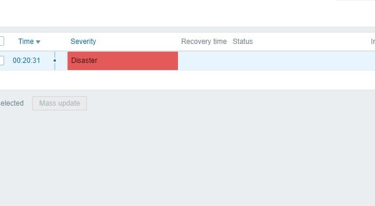
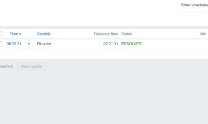
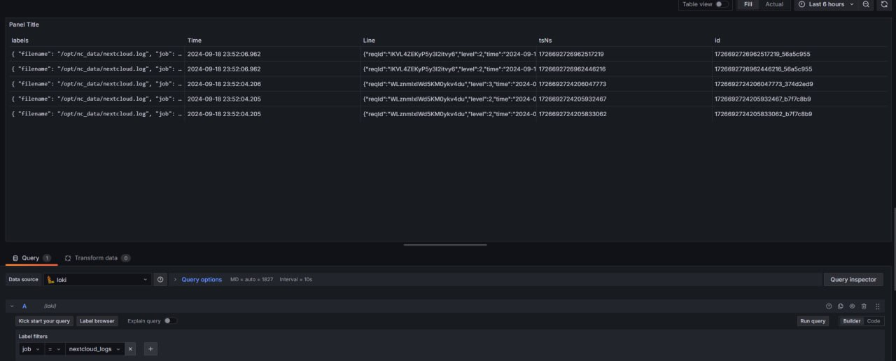
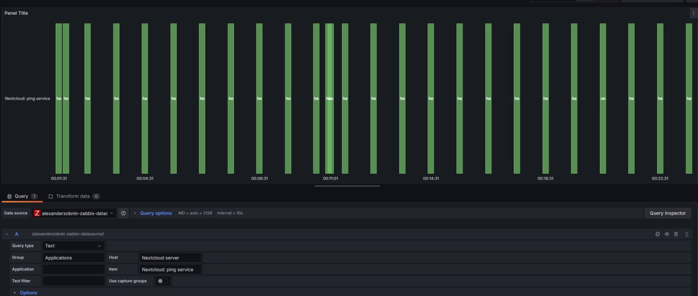

# # ЛР 1. Loki + Zabbix + Grafana

## Часть 1 - Логирвание
Была проведена базовая настройка с использованием предоставленных файлов для Docker.
## Часть 2 - Мониторинг
Провели настройку *Zabbix*, выгрузив соответствующий __template__ с пиногом для теста. А также обозначили ранее настроенный *Nextcloud*, как хост.

Еще проверили работоспособность мониторинга, включили `maintenance:mode` для проверки на ошибки, это можно увидеть на скринах, что все отрабатывает.

## Часть 3
Для начала мы подтянули соотвествуюющий плагин *Zabbix* в *Grafana*, после этого подключили *Loki* и *Zabbix* к *Grafana* для мониторинга. Их работоспособность можно такжк увидеть на скринах.

## Вопросы
1. *Чем SLO отличается от SLA?*

> SLO - это целевое значение SLI, которое необходимо достичь, а SLA - это формальный договор между поставщиком услуги и заказчиком, который описывает общие условия и штрафные санкции и который как раз включает в себя SLO.

2. *Чем отличается инкрементальный бэкап от дифференциального?*

> Следуя из названия, инкрементальный бэкап - это цепочка бэкапов, из чего можно понять, что для восстановления всех данных потребуется каждое звено до полного бэкапа. (сохраняются только последние изменения с последнего бэкапа)

> Дифф. бэкап делает полный бэкап данных каждый промежуток времени, что занимает намного больше места, чем инкремент., но он более надежный.

3. *В чем разница между мониторингом и observability?*

> Мониторинг сосредоточен на отслеживании предопределённых метрик и метрик, связанных с известными проблемами.

> Observability фокусируется на создании условий для полного понимания состояния системы в реальном времени и решения даже тех проблем, которые заранее не предвиделись.
